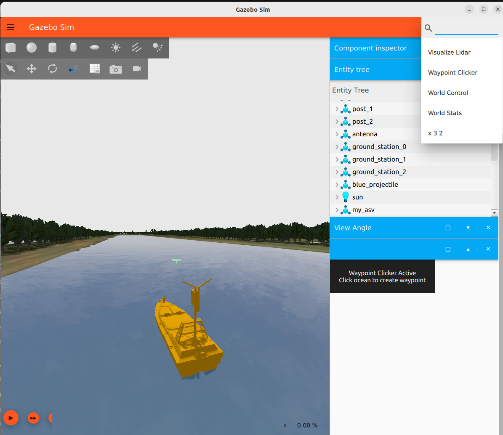
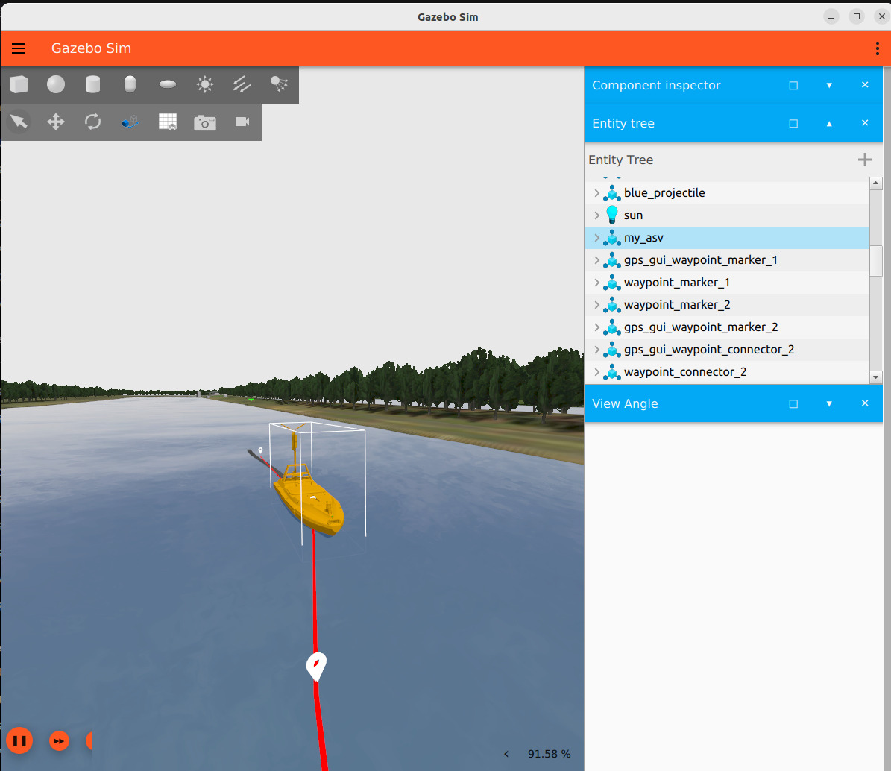
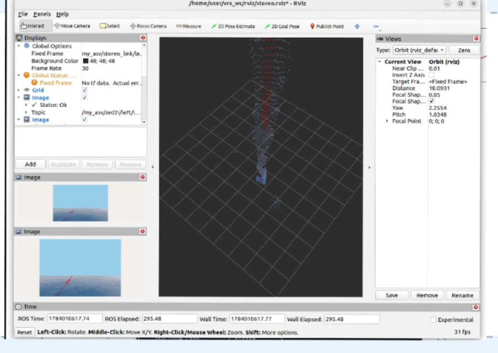
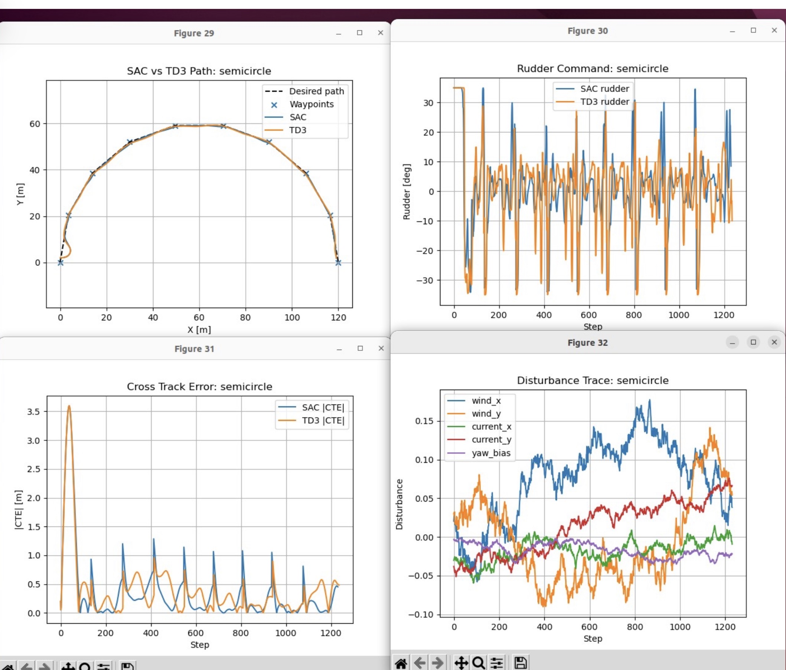
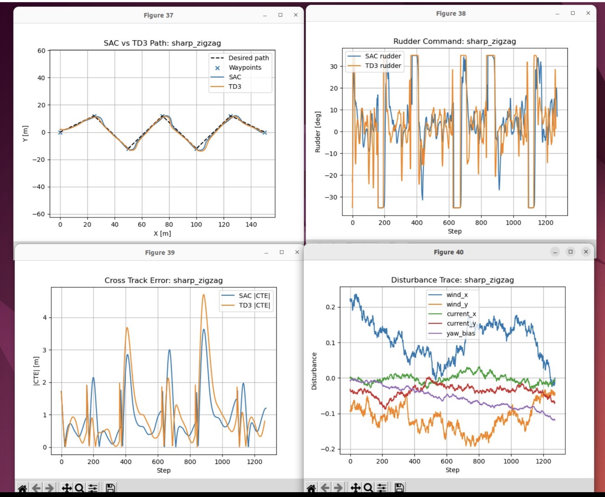

# Autonomous Surface Vehicle Navigation in VRX

**ROS 2 · Gazebo / VRX · Digital Twin Simulation · Software-in-the-Loop (SIL) · Guidance, Navigation & Control (GNC) · Marine Robotics · Reinforcement Learning · Collision Avoidance**

**Engineering Internship · Seaconvoy Systems Engineering Pvt. Ltd. · 2026**

A ROS 2 and Gazebo/VRX-based autonomous surface vessel (ASV) simulation, navigation and control system developed during my engineering internship at **Seaconvoy Systems Engineering Pvt. Ltd.**

The project focused on configuring and validating the existing **NAVIS ASV physics-based simulation model** and progressively developing autonomous-navigation capabilities. The vessel's STL geometry was integrated with simulated dynamics, sensors and control interfaces to form a **Software-in-the-Loop (SIL) / digital-twin testbed** for navigation, control and simulation-based validation.

The engineering workflow progressed from manual vessel control and classical GNC to LiDAR/stereo perception, reinforcement-learning-based guidance and navigation using SAC and TD3, and collision avoidance with static and dynamic obstacles. This work established the technical foundation for subsequent research in **safety-aware multi-vessel autonomous navigation**.

---

## Project Overview

The project was developed progressively from vessel integration and manual control toward autonomous navigation, perception, learning-based guidance and collision avoidance.

```text
NAVIS ASV / VRX Integration
        |
        v
ROS 2 ↔ Gazebo Interface
        |
        v
Keyboard + Joystick Control
        |
        v
GPS + IMU Navigation
        |
        v
Interactive Waypoint Selection
        |
        v
Classical GNC / LOS Guidance
        |
        v
Heading / Rudder Control
        |
        v
LiDAR + Stereo Perception
        |
        v
RViz2 Visualization
        |
        v
SAC / TD3 RL Navigation
        |
        v
Static + Dynamic Obstacle Avoidance
```

---

# NAVIS ASV Digital-Twin / SIL Testbed

The project uses Seaconvoy's **NAVIS autonomous surface vessel** integrated into the VRX `sydney_regatta` simulation environment.

The physics-based simulation platform integrates:

- NAVIS vessel STL geometry
- thruster actuation
- rudder steering
- hydrodynamic behaviour
- GPS / NavSat
- IMU
- LiDAR
- ZED2i stereo camera
- ROS 2 interfaces
- interactive waypoint selection
- keyboard and joystick control

The platform provided a **Software-in-the-Loop (SIL)** environment for developing, integrating and validating navigation, perception and control algorithms before physical-vessel testing.

## Simulation & Validation

The simulation workflow covered:

- physics-based NAVIS ASV simulation in Gazebo / VRX
- Software-in-the-Loop autonomy development
- vessel dynamics and hydrodynamic configuration
- ROS 2 sensor and actuator interface validation
- navigation and closed-loop control testing
- disturbance-based controller evaluation
- simulation-based Verification & Validation (V&V)

---

# System Architecture

```text
                   Waypoint Selection
                          |
                          v
                    GPS Waypoints
                          |
                          v
                    LOS Guidance
                          |
                          v
                   Desired Heading
                          |
                          v
                  Heading Controller
                          |
                          v
               Rudder / Thruster Commands
                          |
                          v
             +-------------------------+
             |       ROS 2 Layer       |
             +-------------------------+
                          |
                          v
             +-------------------------+
             |      Gazebo / VRX       |
             |        NAVIS ASV        |
             +-------------------------+
                          |
            +-------------+-------------+
            |             |             |
            v             v             v
         GPS / IMU      LiDAR       Stereo Camera
            |             |             |
            +-------------+-------------+
                          |
                          v
                        ROS 2
                          |
                          v
                        RViz2
```

---

# Classical Guidance, Navigation & Control (GNC)

The project implements a simulation-level **Guidance, Navigation & Control (GNC)** workflow.

### Guidance

- Waypoint-based path definition
- Line-of-Sight (LOS) guidance
- Look-ahead target generation
- Desired-heading generation

### Navigation

- GPS / NavSat position
- IMU orientation
- Yaw / heading estimation
- Waypoint tracking
- Cross-Track Error (CTE) evaluation

### Control

- Heading-error control
- Rudder commands
- Thruster commands
- Keyboard interface
- Joystick interface
- Autonomous waypoint following
- Nomoto-based vessel-dynamics experimentation

The overall GNC loop is:

```text
        GPS / IMU
            |
            v
      Vessel State
            |
            v
      LOS Guidance
            |
            v
     Desired Heading
            |
            v
      Heading Error
            |
            v
    Steering Control
            |
            v
   Rudder / Thruster
            |
            v
        NAVIS ASV
            |
            v
     Sensor Feedback
            |
            +------> Next Control Cycle
```

---

# Interactive Waypoint Navigation

A custom waypoint workflow was used to create navigation targets directly inside the Gazebo environment.

<p align="center">
  
</p>

<p align="center">
  <em>NAVIS ASV in the VRX environment with the Gazebo Waypoint Clicker activated for interactive waypoint selection.</em>
</p>

The waypoint interface allows navigation targets selected in the simulated environment to enter the ROS 2 navigation pipeline.

```text
Gazebo Waypoint Clicker
          |
          v
    Waypoint Bridge
          |
          v
    /asv/waypoints
          |
          v
      LOS Guidance
          |
          v
   Desired Heading
          |
          v
      ASV Control
```

---

# LOS Path Following

The autonomous navigation system uses **Line-of-Sight (LOS) guidance** to generate a desired heading from the vessel's position relative to the waypoint path.

<p align="center">
  
</p>

<p align="center">
  <em>NAVIS ASV following the generated waypoint path in Gazebo/VRX.</em>
</p>

For consecutive waypoints, LOS guidance selects a target point ahead of the vessel rather than simply steering directly toward the next waypoint.

```text
Waypoint A -------------------------------- Waypoint B
                          *
                      LOS Target
                         /
                        /
                       /
                    NAVIS ASV
```

A look-ahead distance is used to obtain smoother path-following behaviour.

## Cross-Track Error

Navigation performance is evaluated using **Cross-Track Error (CTE)**.

CTE represents the lateral displacement of the vessel from the desired path.

```text
Desired Path
------------------------------------------------
                         |
                         | CTE
                         |
                       Vessel
```

Tracking CTE allows path-following performance to be evaluated quantitatively rather than relying only on visual inspection.

---

# Heading & Vessel Control

The desired heading generated by LOS guidance is compared with the vessel heading obtained from the IMU.

```text
Desired Heading --------+
                        |
                        v
                  Heading Error
                        ^
                        |
Current Heading --------+
                        |
                        v
                 Heading Control
                        |
                        v
                  Rudder Command
                        |
                        v
                     NAVIS ASV
```

The control system interfaces with:

- rudder commands
- thruster commands
- vessel heading
- vessel position
- waypoint information

through ROS 2.

---

# Keyboard & Joystick Interface Control

Manual vessel control was implemented before autonomous navigation to validate the ROS 2–Gazebo command interface and vessel response.

## Keyboard Control

The repository includes:

```text
keyboard_asv_control
```

for direct thruster and rudder commands.

This was used during initial vessel integration and functional testing.

## Joystick Interface & Teleoperation

A **Logitech game controller** was integrated into the ROS 2 control pipeline for manual ASV operation.

```text
Logitech Joystick
       |
       v
    joy_node
       |
       v
joystick_asv_control
       |
   +---+---+
   |       |
   v       v
Thruster  Rudder
Command   Command
   |       |
   +---+---+
       |
       v
    NAVIS ASV
```

The joystick interface was used to test:

- manual vessel manoeuvring
- thruster response
- rudder response
- ROS 2 command transmission
- steering behaviour
- vessel dynamics
- transition from manual to autonomous control

This provided a practical control interface for validating the simulated ASV before autonomous GNC algorithms were introduced.

---

# Vessel Dynamics

Simplified vessel behaviour is represented using a first-order **Nomoto yaw model**:

```text
T · dr/dt + r = K · δ
```

where:

- `T` — vessel response time constant
- `K` — steering gain
- `r` — yaw rate
- `δ` — rudder command

The repository includes components for experimenting with Nomoto-based yaw dynamics alongside the Gazebo vessel simulation.

Hydrodynamic parameters were also configured to obtain usable surge, sway and yaw behaviour for navigation and control experiments.

---

# Sensor Integration

The NAVIS ASV simulation integrates multiple sensors supporting navigation, perception and system evaluation.

| Sensor | Application |
|---|---|
| **GPS / NavSat** | Vessel position and waypoint navigation |
| **IMU** | Orientation, yaw and heading estimation |
| **LiDAR** | Range sensing and obstacle perception |
| **ZED2i Stereo Camera** | Stereo imagery and 3D perception |

## GPS / NavSat

GPS/NavSat data provides vessel-position information to the navigation pipeline.

```text
Gazebo NavSat
      |
      v
Gazebo Transport
      |
      v
ROS 2 Interface
      |
      v
Vessel Position
      |
      v
Waypoint Navigation
```

## IMU

The simulated IMU provides vessel orientation information.

Quaternion orientation is processed to obtain yaw/heading for navigation and control.

```text
Gazebo IMU
     |
     v
ROS 2
     |
     v
Orientation
     |
     v
Yaw / Heading
     |
     v
GNC Pipeline
```

## LiDAR

A simulated LiDAR provides range measurements for obstacle perception and collision-avoidance development.

Gazebo LiDAR data is bridged into ROS 2 and represented using:

```text
sensor_msgs/msg/LaserScan
```

The repository also contains LiDAR monitoring and debugging utilities.

```text
Gazebo LiDAR
     |
     v
Gazebo Transport
     |
     v
ROS–Gazebo Bridge
     |
     v
LaserScan
     |
     v
ROS 2 Processing
```

---

# Stereo Vision & 3D Point Cloud

A simulated **ZED2i stereo camera** was integrated into the NAVIS ASV sensor stack.

The stereo pipeline provides:

- left-camera image
- right-camera image
- camera calibration information
- stereo disparity
- reconstructed 3D point cloud

```text
       ZED2i Stereo Camera
               |
        +------+------+
        |             |
        v             v
   Left Image     Right Image
        |             |
        +------+------+
               |
               v
       stereo_image_proc
               |
               v
           Disparity
               |
               v
          PointCloud2
               |
               v
             RViz2
```

## RViz2 Visualization

<p align="center">
  
</p>

<p align="center">
  <em>RViz2 visualization of stereo-camera images together with the reconstructed 3D PointCloud2 output.</em>
</p>

RViz2 was used to inspect the simulated sensor pipeline and verify the ROS 2 perception outputs.

---

# ROS 2 / Gazebo Integration

Guidance and control algorithms operate as ROS 2 nodes while vessel physics and sensor simulation run in Gazebo.

```text
ROS 2 GNC / Controller
          |
     +----+----+
     |         |
     v         v
 Thruster    Rudder
 Command     Command
     |         |
     +----+----+
          |
          v
     Gazebo Relay
          |
          v
      NAVIS ASV
          |
          v
   Simulated Sensors
          |
          v
        ROS 2
```

This architecture separates guidance, sensing and control components from the underlying simulator and supports SIL development and simulation-based validation.

---

# Reinforcement-Learning-Based Guidance & Navigation

The internship project was extended from classical LOS-based navigation to **learning-based continuous-control experiments**.

Two off-policy reinforcement-learning algorithms with MLP policies were investigated:

### Soft Actor-Critic (SAC)

and

### Twin Delayed Deep Deterministic Policy Gradient (TD3)

The repository contains trained policy checkpoints:

```text
rl_models/
├── sac_asv_waypoint.zip
└── td3_asv_waypoint.zip
```

The RL environment uses simplified Nomoto vessel dynamics and continuous rudder control for waypoint/path-following experiments.

Both policies were trained for **900,000 timesteps** in the experimental study.

---

# SAC vs TD3 Evaluation

The trained SAC and TD3 policies were evaluated across **10 path geometries**, including:

- straight paths
- moderate turns
- sharp turns
- U-turn
- triangle
- oval
- semicircle
- smooth curve
- mixed-curvature paths
- sharp zigzag

The evaluation considered three operating regimes:

1. **No disturbance**
2. **Current disturbance**
3. **Current + sensor noise**

The experiments evaluated:

- trajectory tracking
- Cross-Track Error (CTE)
- rudder behaviour
- path geometry
- disturbance response
- sensor-noise robustness

---

## Semicircle Evaluation

<p align="center">
  
</p>

<p align="center">
  <em>SAC vs TD3 semicircle evaluation showing trajectory tracking, rudder command, cross-track error and disturbance traces.</em>
</p>

The semicircle experiment tests continuous curved-path tracking and compares the two learned controllers over sustained curvature.

The figure combines:

- desired path and waypoints
- SAC trajectory
- TD3 trajectory
- rudder commands
- absolute CTE
- disturbance traces

---

## Sharp-Zigzag Evaluation

<p align="center">
  
</p>

<p align="center">
  <em>SAC vs TD3 sharp-zigzag evaluation showing trajectory tracking, steering activity, cross-track error and environmental disturbances.</em>
</p>

The sharp-zigzag trajectory represents a demanding path-following condition because the desired heading changes rapidly and repeatedly.

It provides a stress test for:

- steering response
- tracking accuracy
- controller recovery
- rudder activity
- disturbance robustness

---

# SAC vs TD3 Results

In the nominal no-disturbance evaluation, both trained controllers successfully completed all ten test paths.

| Metric | SAC | TD3 |
|---|---:|---:|
| Successful paths | **10 / 10** | **10 / 10** |
| Mean CTE | **0.245 m** | **0.455 m** |

In the nominal ten-path comparison, SAC achieved lower mean cross-track error than TD3.

The broader experiments also evaluated the policies under environmental current and sensor-noise conditions to examine robustness beyond nominal path following.

The comparison considered:

- path-tracking accuracy
- steering behaviour
- control effort
- robustness
- sensitivity to path geometry

---

# Static & Dynamic Obstacle Avoidance

The autonomous-navigation framework was further extended to **collision avoidance with static and dynamic obstacles**.

This stage moved the project beyond nominal path tracking toward navigation in environments where the controller must balance:

- waypoint/path progress
- cross-track error
- obstacle clearance
- steering behaviour
- collision avoidance
- robustness to changing encounter geometry

LiDAR-based environmental observations were incorporated into the learning-based navigation workflow for obstacle-aware control.

This work established the technical foundation for subsequent research in **safety-aware multi-vessel autonomous navigation**.

### [View related multi-vessel safety research →](https://github.com/Padma1320/ASV-Collision-Avoidance)

---

# Main ROS 2 Nodes

The `asv_control` package contains nodes covering navigation, sensing, control, visualization and debugging.

Key executables include:

```text
keyboard_asv_control
joystick_asv_control
asv_gz_relay
imu_rpy_publisher
gps_publisher
path_publisher
gazebo_path_trail
gazebo_click_waypoint_node
adaptive_los_pid_follower
nomoto_gz_pose_sim
lidar_debug_node
sensor_sync_logger
```

> `adaptive_los_pid_follower` is retained here because it is the executable name used in the source code. The guidance method is referred to throughout this documentation as **LOS guidance**.

---

# ROS 2 / Gazebo Packages

The workspace contains several custom packages supporting the simulated ASV platform.

```text
src/
├── asv_control/
├── asv_line_trail_cpp/
├── asv_trail_plugin/
├── gps_waypoint_gui_bridge/
├── gz_waypoint_bridge/
├── gz_waypoint_clicker/
├── my_asv_controller/
├── navis_model/
├── nomoto_plugin/
└── vrx_linear_boat/
```

### `asv_control`

Main ROS 2 package containing navigation, control and sensor-processing nodes.

### `gps_waypoint_gui_bridge`

Interface for transferring waypoint information into the ROS 2 navigation pipeline.

### `gz_waypoint_bridge`

Bridge between Gazebo waypoint interaction and ROS 2.

### `gz_waypoint_clicker`

Gazebo GUI component supporting interactive waypoint selection.

### `nomoto_plugin`

Gazebo plugin supporting simplified Nomoto vessel dynamics.

### Path / Trail Components

Additional packages provide path and trajectory visualization during simulation.

---

# Repository Structure

```text
Autonomous-surface-vehicle-in-VRX-internship-/
│
├── src/
│   ├── asv_control/
│   ├── asv_line_trail_cpp/
│   ├── asv_trail_plugin/
│   ├── gps_waypoint_gui_bridge/
│   ├── gz_waypoint_bridge/
│   ├── gz_waypoint_clicker/
│   ├── my_asv_controller/
│   ├── navis_model/
│   ├── nomoto_plugin/
│   └── vrx_linear_boat/
│
├── rl_models/
│   ├── sac_asv_waypoint.zip
│   └── td3_asv_waypoint.zip
│
├── rviz/
│   └── stereo.rviz
│
├── IMG_0238.jpeg
├── IMG_0239.jpeg
├── IMG_0240.jpeg
├── IMG_0242.jpeg
├── IMG_0244.jpeg
│
├── bag_to_csv_plot.py
├── gazebo_lidar_monitor.py
├── gazebo_stereo_monitor.py
├── launch_asv_system.sh
├── lidar_bridge.yaml
├── my_asv_world.sdf
├── sensor_sync_log.csv
└── README.md
```

---

# Running the Project

The repository contains the development launcher:

```bash
./launch_asv_system.sh
```

The launcher was used to coordinate the main simulation, vessel and ROS 2 components.

> **Note:** The launcher originates from the internship development environment and may contain machine-specific paths. These should be updated when reproducing the project on another system.

---

## Build

The project follows a ROS 2 workspace structure and can be built using `colcon`.

```bash
source /opt/ros/humble/setup.bash

colcon build --symlink-install

source install/setup.bash
```

The corresponding VRX installation and required simulation assets must also be available.

---

## Example Nodes

### Gazebo Relay

```bash
ros2 run asv_control asv_gz_relay
```

### Keyboard Control

```bash
ros2 run asv_control keyboard_asv_control
```

### Joystick Control

```bash
ros2 run joy joy_node
ros2 run asv_control joystick_asv_control
```

### GPS

```bash
ros2 run asv_control gps_publisher
```

### IMU

```bash
ros2 run asv_control imu_rpy_publisher
```

### Path Visualization

```bash
ros2 run asv_control path_publisher
```

### LOS Waypoint Follower

```bash
ros2 run asv_control adaptive_los_pid_follower
```

### LiDAR Debugging

```bash
ros2 run asv_control lidar_debug_node
```

---

# Technologies & Skills

## Robotics & Simulation

- ROS 2 Humble
- Gazebo Sim
- Virtual RobotX (VRX)
- RViz2
- SDF
- ROS–Gazebo interfaces
- Custom Gazebo plugins
- Autonomous Surface Vehicles
- Digital Twin Simulation
- Physics-Based Simulation
- Software-in-the-Loop (SIL)
- Simulation-Based Verification & Validation (V&V)

## Guidance, Navigation & Control (GNC)

- Waypoint navigation
- Line-of-Sight (LOS) guidance
- Cross-Track Error (CTE)
- Desired-heading generation
- Heading-error control
- Rudder control
- Thruster control
- Joystick interface & teleoperation
- Keyboard control
- Nomoto first-order vessel dynamics
- Hydrodynamic modelling
- Path-following evaluation

## Sensors & Perception

- GPS / NavSat
- IMU
- LiDAR
- LaserScan
- ZED2i stereo camera
- Stereo disparity
- PointCloud2
- Sensor synchronization
- Sensor logging

## Reinforcement Learning

- Stable-Baselines3
- Gymnasium
- Soft Actor-Critic (SAC)
- Twin Delayed DDPG (TD3)
- MLP policies
- Continuous control
- Observation/action design
- Reward design
- Policy training
- Policy checkpointing
- Multi-path evaluation
- Disturbance testing
- Sensor-noise testing
- Static obstacle avoidance
- Dynamic obstacle avoidance

## ROS 2 Development

- `rclpy`
- ROS 2 nodes
- Publishers / subscribers
- Topics
- Sensor messages
- ROS–Gazebo bridges
- Custom ROS 2 packages
- ROS 2 CLI
- `colcon`

## Programming & Development

- Python
- C++
- NumPy
- Bash
- Linux / Ubuntu 22.04
- Git
- GitHub

## Evaluation & Visualization

- CSV logging
- Matplotlib
- RViz2
- Gazebo visualization
- CTE analysis
- Rudder-command analysis
- Path visualization
- Quantitative policy comparison
- Multi-scenario testing

---

# Internship Scope

This repository represents the **engineering development, classical GNC, perception, reinforcement-learning navigation and collision-avoidance work carried out around the NAVIS ASV simulation platform during the internship**.

```text
NAVIS ASV / VRX Integration
            |
            v
ROS 2 ↔ Gazebo Communication
            |
            v
Keyboard + Joystick Control
            |
            v
GPS + IMU Navigation
            |
            v
Waypoint Interface
            |
            v
Classical GNC / LOS Path Following
            |
            v
LiDAR + Stereo Perception
            |
            v
SAC / TD3 RL Navigation
            |
            v
Static + Dynamic Obstacle Avoidance
```

The project established the simulation, sensing, GNC and obstacle-aware navigation foundation that was subsequently extended into research on safety-aware multi-vessel autonomous navigation.

---

# Related Research

Building on the autonomous-navigation and collision-avoidance work developed during the ASV internship, subsequent research investigates **safety-aware multi-vessel navigation** using recurrent reinforcement learning and predictive safety intervention.

The research framework includes:

- recurrent PPO steering and speed policies
- variable-speed navigation
- multi-vessel encounter scenarios
- joint residual reinforcement learning
- CPA / TCPA reasoning
- COLREGS-aware navigation
- receding-horizon predictive safety filtering
- progress-aware safe-action selection
- robustness evaluation
- component-ablation studies

### [Safety-Aware Autonomous Surface Vessel Navigation — Research Repository](https://github.com/Padma1320/ASV-Collision-Avoidance)

**Research status: Under Review — IEEE ICRA 2027 · Extended work in progress**

The internship and research repositories are kept separate to distinguish the original **engineering, GNC, SAC/TD3 and obstacle-avoidance development** from the subsequent **multi-vessel safety research**.

---

# Project Context

This work was developed during an engineering internship at **Seaconvoy Systems Engineering Pvt. Ltd.**

The internship involved configuring and validating Seaconvoy's existing NAVIS ASV model in Gazebo/VRX, establishing the ROS 2 simulation framework, and developing navigation, sensing, control, reinforcement-learning and collision-avoidance experiments around the simulated vessel platform.

---
